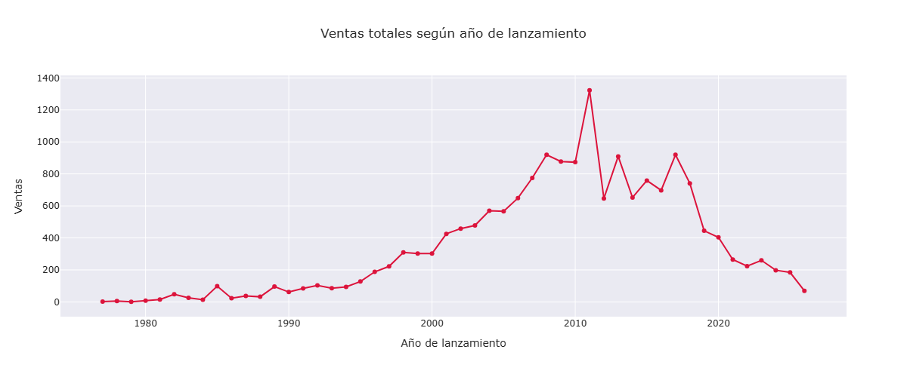
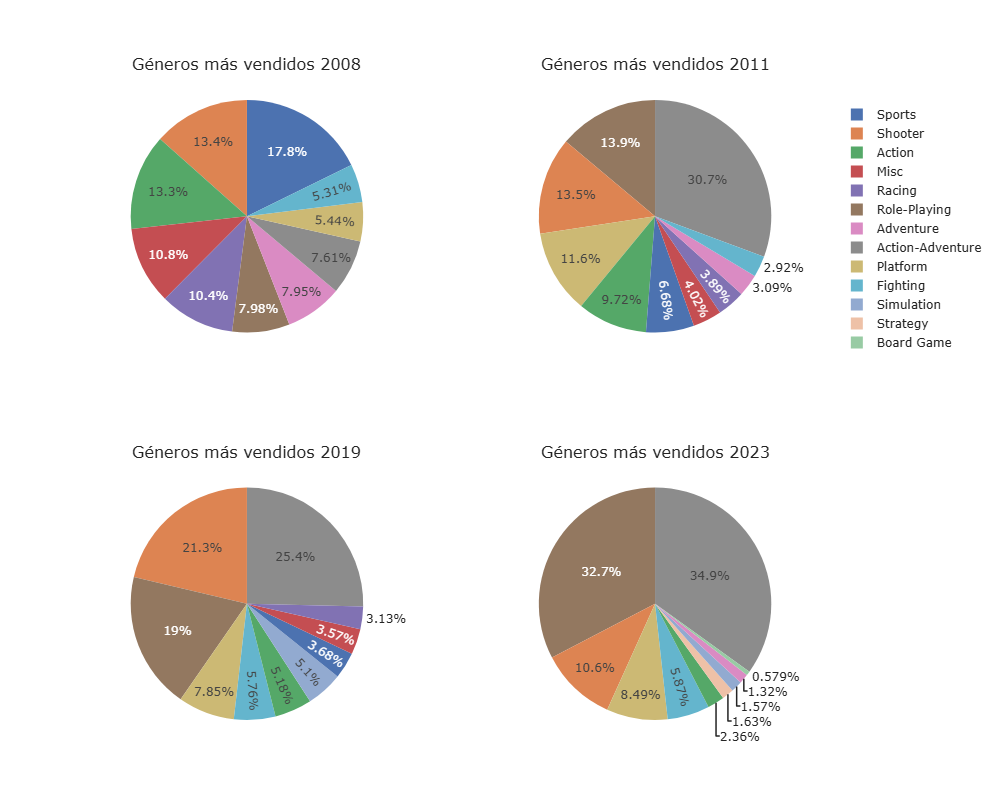
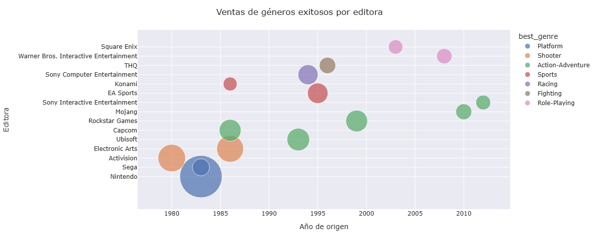
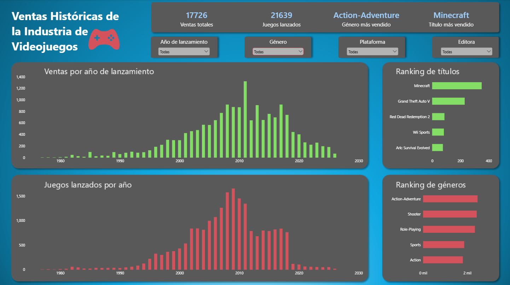

# Análisis de ventas de Videojuegos

Análisis exploratorio y visualiazción de datos de ventas de videojuegos, con el objetivo de representar e identificar tendencias en la industria y explorar elementos como los géneros, años, editoras y la evolución de las ventas, con el objetivo de responder la pregunta principal de la investigación: ¿Qué factores determinan el éxito en ventas de un videojuego?

### Descripción del proyecto

Este proyecto analiza un dataset de ventas de videojuegos que contiene información sobre títulos, plataformas, géneros, publishers, desarrolladores, fechas de lanzamiento y ventas reportadas en distintas regiones.

Además de la pregunta objetivo, el análisis busca responder preguntas como:

* ¿Cómo han evolucionado las ventas y lanzamientos de videojuegos a través de los años?
* ¿Qué géneros generan mayores ventas?
* ¿Qué editoras concentran una mayor cantidad de ventas?
* ¿Cuáles son los videojuegos más vendidos?
* ¿Cómo se distribuyen las ventas entre las distintas regiones?

El proyecto combina Python para la limpieza y análisis exploratorio con Power BI para la visualización y creación de un dashboard interactivo.

### Objetivo general

Analizar los patrones y tendencias presentes en las ventas de videojuegos para obtener información relevante sobre el comportamiento de la industria.

### Objetivos específicos

* Limpiar y preparar los datos para su análisis.
* Analizar la evolución de los lanzamientos y ventas en diferentes años de origen.
* Identificar los géneros y publishers con mejores resultados.
* Analizar la distribución regional de las ventas.
* Identificar los videojuegos con mayores ventas reportadas.
* Identificar las sagas de videojuegos más populares.
* Construir un dashboard interactivo que permita explorar los resultados.

### Dataset individual

El dataset contiene información sobre videojuegos individuales y sus ventas reportadas.

Algunas de las variables principales son:

| Variable       | Descripción                                     |
| -------------- | ------------------------------------------------ |
| title          | Nombre del videojuego                            |
| console        | Plataforma                                       |
| genre          | Género principal del videojuego                 |
| publisher      | Publisher/Editora                                |
| year           | Año de lanzamiento                              |
| units_reported | Unidades totales vendidas                        |
| na_sales       | Ventas reportadas en Norteamérica               |
| jp_sales       | Ventas reportadas en Japón                      |
| pal_sales      | Ventas reportadas en Europa y otras regiones PAL |
| other_sales    | Ventas reportadas en otras regiones              |

Nota: Las ventas regionales presentan valores faltantes para una parte de los registros. Por esta razón, el análisis regional debe interpretarse como representativo de los registros que cuentan con información regional disponible y no necesariamente del total del dataset.

### Dataset de series

El dataset de series contiene información de las diferentes sagas de videojuegos. Se decidió separar el dataset original en individual y series para un mejor análisis.

Algunas de las variables principales son:

| Variable       | Descripción                                     |
| -------------- | ------------------------------------------------ |
| title          | Nombre del videojuego                            |
| genre          | Género principal del videojuego                 |
| publisher      | Publisher/Editora                                |
| year           | Año de lanzamiento                              |
| total_shipped | Unidades totales vendidas                        |

### Limpieza de datos

Antes del análisis exploratorio se realizó un proceso de limpieza utilizando Pandas.

Entre las principales tareas realizadas se encuentran:

* Conversión de release_date al formato de fecha.
* Eliminación de columnas innecesarias para el análisis.
* Extracción del año de lanzamiento como columna *year*.
* Identificación y tratamiento de valores faltantes.
* Revisión de duplicados.
* Revisión de tipos de datos.
* Tratamiento de las columnas de ventas regionales.
* Verificación de la consistencia entre ventas totales y ventas regionales.
* Revisión de categorías y valores inconsistentes.

Las decisiones de limpieza fueron tomadas considerando el contexto de cada variable y su impacto potencial en el análisis de acuerdo a los alcances y objetivos del proyecto.

### Análisis exploratorio

El análisis exploratorio se realizó utilizando Python, principalmente mediante:

* Pandas
* NumPy
* Plotly
* Seaborn

Se analizaron diferentes dimensiones del dataset, incluyendo:

#### Evolución temporal

Se estudió la cantidad de videojuegos lanzados y las ventas reportadas según el año de lanzamiento.

#### Géneros

Se compararon los géneros según su cantidad de lanzamientos y volumen de ventas.

#### Publishers

Se identificaron los publishers con mayor cantidad de videojuegos y mayores ventas reportadas.

#### Videojuegos más vendidos

Se analizaron los títulos con mayores ventas reportadas, considerando las particularidades del dataset para evitar sobreestimar las ventas cuando un mismo título aparece asociado a múltiples plataformas.

#### Distribución de ventas

Se estudiaron las distribuciones de las ventas y la presencia de valores extremos.

### Dashboard

Los resultados principales se presentan mediante un dashboard interactivo desarrollado en Power BI.

El dashboard permite filtrar los datos utilizando diferentes dimensiones:

* Año de lanzamiento
* Género
* Plataforma
* Publisher

#### Vista previa

### Limitaciones

Este análisis presenta algunas limitaciones relacionadas con la naturaleza del dataset:

* No todos los videojuegos cuentan con información de ventas regionales.
* Algunos videojuegos aparecen en múltiples plataformas.
* El año utilizado en el análisis corresponde al año de lanzamiento, no al año en que se produjeron las ventas.
* La disponibilidad de información puede variar considerablemente entre videojuegos y plataformas.

Estas limitaciones deben considerarse al interpretar los resultados.

### Tecnologías utilizadas

* Python 3
* Pandas — limpieza y manipulación de datos
* NumPy — operaciones numéricas
* Plotly — visualizaciones interactivas
* Seaborn — visualización exploratoria
* Power BI — dashboard y visualización
* DAX — medidas y cálculos en Power BI
* Jupyter Notebook — desarrollo del análisis

### Estructura del proyecto

│   README.md
│   requirements.txt
│
├───dashboard
│       dashboard_overview.png
│       dashboard_vg.pbix
│
├───data
│   │   date_corrections.txt
│   │
│   ├───processed
│   │       sales_ind_clean.csv
│   │       sales_series_clean.csv
│   │
│   └───raw
│           gamesresult.jl
│           scraping.py
│           vg_sales_2025.csv
│
├───images
│       genres_publisher.png
│       genres_year.png
│       sales_release_year.png
│       sales_success.png
│
└───notebooks
        eda_vg_sales.ipynb
        limpieza_grande.ipynb

### Fuentes y créditos

#### Datos

Los datos utilizados en este proyecto fueron obtenidos mediante web scraping de VGChartz.

#### Web scraper

El proceso de extracción de datos se basó en el repositorio de GitHub "vgchartz-crawler", desarrollado por el usuario "baynebrannen":

https://github.com/baynebrannen/vgchartz-crawler

El repositorio se encuentra publicado bajo CC0 1.0 Universal, por lo que su contenido puede ser reutilizado, modificado y redistribuido sin requerir atribución.

Aun así, se incluye este reconocimiento como buena práctica y para distinguir el trabajo utilizado como base del trabajo desarrollado en este proyecto.

El presente proyecto incluye un ligero proceso propio de adaptación del código de scraping, limpieza y transformación de los datos, análisis exploratorio y visualización mediante Power BI.

### Autor

Diego Sáez V.

Intereses: Data Analysis · Data Science · Machine Learning · Data Engineering

GitHub
LinkedIn

### Licencia

Este proyecto fue desarrollado con fines educativos y de portafolio.
